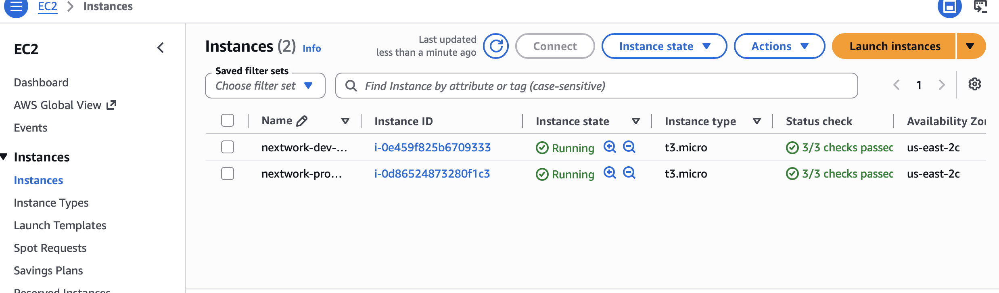

# Cloud Security with AWS IAM

## Overview
Used AWS Identity and Access Management (IAM) to control access to 
AWS resources as part of the Nextwork AWS Cloud Beginner series. 
Simulated onboarding a new intern by setting up permissions that 
allowed access to a development environment but not production.

## AWS Services Used
- AWS IAM
- Amazon EC2

## What I Did
- Launched two EC2 instances for development and production environments
- Used tags to identify and differentiate resources by environment
- Created an IAM policy to allow access to development instances only
- Created an IAM user group and attached the policy to it
- Created an IAM user and assigned them to the appropriate user group
- Tested IAM access to verify the user could only access the development instance

## Key Concepts Learned
- How to launch and tag EC2 instances by environment
- How IAM policies use conditions to control access based on resource tags
- How to create IAM users and user groups with the correct permissions
- How to test and verify IAM access controls

## Screenshots

### EC2 Instances (Development and Production)

### IAM JSON Policy

### IAM Account Alias

### Stopping the Development Instance

## Resources
- [Nextwork Project Guide](https://learn.nextwork.org/projects/aws-security-iam)
- [AWS IAM Documentation](https://docs.aws.amazon.com/iam/)
