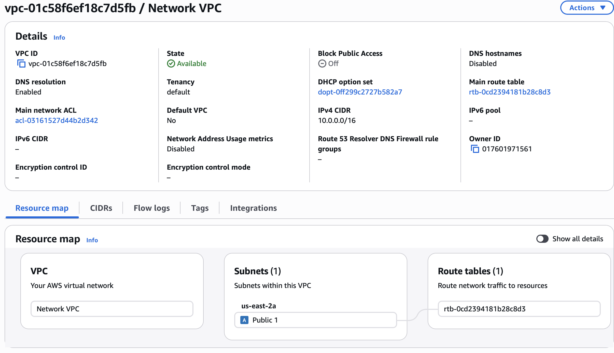

# Build a Virtual Private Cloud (VPC)

## Overview
Created a custom Virtual Private Cloud (VPC) on AWS as part of the 
Nextwork AWS Cloud Beginner series. Configured the network with a 
public subnet and route table to manage traffic within the VPC.

## AWS Services Used
- Amazon VPC

## What I Did
- Created a custom VPC with an IPv4 CIDR block of 10.0.0.0/16
- Created a public subnet within the VPC
- Configured a route table to direct network traffic
- Verified the VPC resource map showing the VPC, subnet, and route table

## Key Concepts Learned
- What a VPC is and why it is used to isolate resources in AWS
- How subnets divide a VPC into smaller network segments
- How route tables control where network traffic is directed
- The difference between a default VPC and a custom VPC

## Screenshots

## Resources
- [Nextwork Project Guide](https://learn.nextwork.org/projects/aws-networks-vpc?track=high)
- [AWS VPC Documentation](https://docs.aws.amazon.com/vpc/)
